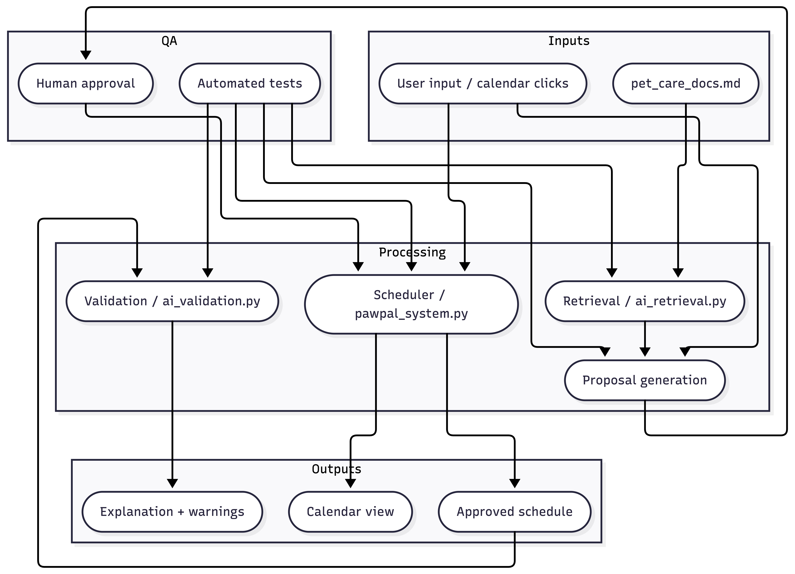

# PawPal+ (Module 2 Project)

Thsi project builds **PawPal+**, a Streamlit app that helps a pet owner plan care tasks for their pet.

## Scenario

A busy pet owner needs help staying consistent with pet care. They want an assistant that can:

- Track pet care tasks (walks, feeding, meds, enrichment, grooming, etc.)
- Consider constraints (time available, priority, owner preferences)
- Produce a daily plan and explain why it chose that plan

This project workflow first designed the system (UML), then implemented the logic in Python, then connected it to Streamlit UI.

## What Was Built

This final app:

- Let a user enter basic owner + pet info
- Let a user add/edit tasks (duration + priority at minimum)
- Generate a daily schedule/plan based on constraints and priorities
- Display the plan clearly (and ideally explain the reasoning)
- Include tests for the most important scheduling behaviors


## Architecture


## Getting started

### Setup

```bash
python -m venv .venv
source .venv/bin/activate  # Windows: .venv\Scripts\activate
pip install -r requirements.txt
```

### Smarter Scheduling
There are currently four major algorithmic features: sorting by time, multi-criteria filtering, automatic task rescheduling on completion, and conflict detection. Sorting by time displays tasks in chronological order in a HH:MM format, regardless of insertion order. Multi-criteria filtering allows a user to sort by completed tasks and by pet. Automatic task rescheduling on completion checks if the task is marked complete and if frequency is "daily" or "weekly", calculates the next occurrence of a task, then creates a new task instance for the next cycle and adds it to a scheduler. Lastly, conflict detection identifies tasks with the same HH:MM and generates a warning message about the conflict.

## Features

### Chronological Schedule Sorting
Tasks are sorted by their `HH:MM` time string using Python's built-in `sorted()` with a key function, ensuring the schedule always displays in chronological order regardless of insertion order. Supports both ascending and descending order.

### Time Conflict Detection
The scheduler groups tasks by their exact timestamp using a `defaultdict`, then scans for groups with more than one task. Any conflicts surface as human-readable warning messages (e.g., `"Time conflict at 2026-03-29 08:00: Mochi (Walk), Luna (Feeding)"`) displayed in the UI before the schedule renders.

### Automatic Task Recurrence on Completion
Marking a `daily` or `weekly` task complete triggers the scheduler to calculate the next occurrence (`+1 day` or `+7 days`) and automatically create and append a new `Task` instance to both the pet's task list and the scheduler — so the next cycle is always ready without manual re-entry.

### Recurring Task Expansion
Tasks can be flagged as recurring with a `recurrence_interval` (`timedelta`). The scheduler expands them into concrete, non-recurring instances across any given date range — useful for viewing a multi-day plan without duplicating source tasks.

### Multi-Criteria Filtering
Tasks can be filtered by completion status alone or combined with a pet name, making it easy to view pending tasks for a specific pet.

### Next Task Lookup
`get_next_task()` returns the single soonest upcoming task using `min()` over the task list by time — an O(n) scan that's simple and correct for the expected dataset size.

### Testing PawPal+
To run tests, use ```python -m pytest```

Test coverage includes verification on the following:
    - Sorting correctness: tasks are returned in chronological order
    - Recurrence logic: marking a daily task complete creates a new task for the following day
    - Conflict dectection: Scheduler flags duplicate times

Confidence Level in system reliability based on test results: 5/5

## Demo


