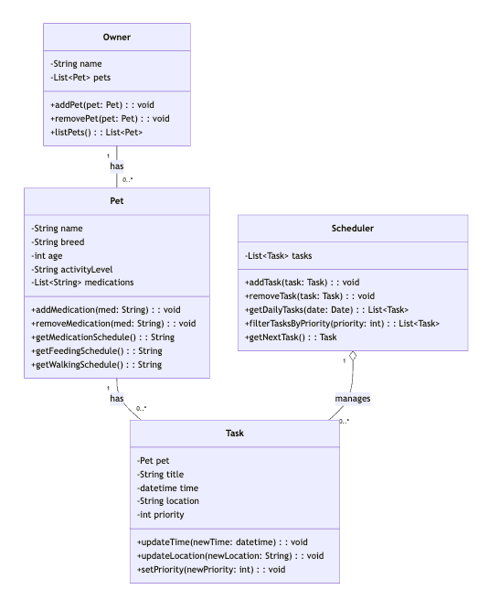

# PawPal+ Project Reflection

## 1. System Design
As stated in the README, PawPal is a stremalit app that helps a pet owner plan care tasks for their pet. PawPal must have functionality to track pet care tasks, consider contraints, and produce and explain a daily plan for the owner. 

**a. Initial design**
Three core actions a user should be able to perform are adding a pet, view today's tasks, and schedule a task. 

Classes that will help accomplish these actions are Owner, Pet, Task, and Scheduler. Owner attributes will be name and pet list. Owner will have responsibilities like adding a pet. Pet attribues will be name, breed, age, activity level, and medications. Pet will have responsibilities like keeping track of what medications the pet needs and at what intervals, a feeding schedule, and a walking schedule. Task attributes will be pet, name, time, location, and priority. Task will have responsibilities like update time and update location. Scheduler will have a tasks attribute. Scheduler will have responsibilities like adding a task, displaying daily tasks and filtering by priority.

UML Diagram:

**b. Design changes**

Yes, my design changed during implementation to include missing relationships. One specific change I made based on Copilot feedback was to add a scheduler attribute to Owner so that they can create tasks for their pets. Another change I made was to add a tasks: List[Task] attribute to Pet for easy display of tasks for a certain Pet.

---

## 2. Scheduling Logic and Tradeoffs

**a. Constraints and priorities**

- What constraints does your scheduler consider (for example: time, priority, preferences)?
- How did you decide which constraints mattered most?

One constraint my scheduler considers is time- tasks are sorted by their scheduled time. Time conflicts are also detected and the system gives a warning to the user. I decided that time constraint mattered most because, as an app that is based on scheduling, most likely every user cares about time to care for their pet properly.

**b. Tradeoffs**

- Describe one tradeoff your scheduler makes.
- Why is that tradeoff reasonable for this scenario?

One tradeoff my scheduler makes is to only check for exact time matches instead of overlapping durations. This tradeoff is reasonable for this scenario because some tasks have variable time frames. For example, even if you have an appointment scheduled for the vet, there may be additional waiting time or extra information to talk about afterwards. Plus, the full daily schedule is shown to the owner anyway, so they can glance at it and decide, with their trained judgement, if any time periods overlap.

**c. Smarter Scheduling**
There are currently four major algorithmic features: sorting by time, multi-criteria filtering, automatic task rescheduling on completion, and conflict detection. Sorting by time displays tasks in chronological order in a HH:MM format, regardless of insertion order. Multi-criteria filtering allows a user to sort by completed tasks and by pet. Automatic task rescheduling on completion checks if the task is marked complete and if frequency is "daily" or "weekly", calculates the next occurrence of a task, then creates a new task instance for the next cycle and adds it to a scheduler. Lastly, conflict detection identifies tasks with the same HH:MM and generates a warning message about the conflict.

---

## 3. AI Collaboration

**a. How you used AI**

- How did you use AI tools during this project (for example: design brainstorming, debugging, refactoring)?
- What kinds of prompts or questions were most helpful?

**b. Judgment and verification**

- Describe one moment where you did not accept an AI suggestion as-is.
- How did you evaluate or verify what the AI suggested?

---

## 4. Testing and Verification

**a. What you tested**

- What behaviors did you test?
- Why were these tests important?

**b. Confidence**

- How confident are you that your scheduler works correctly?
- What edge cases would you test next if you had more time?

---

## 5. Reflection

**a. What went well**

- What part of this project are you most satisfied with?

**b. What you would improve**

- If you had another iteration, what would you improve or redesign?

**c. Key takeaway**

- What is one important thing you learned about designing systems or working with AI on this project?
